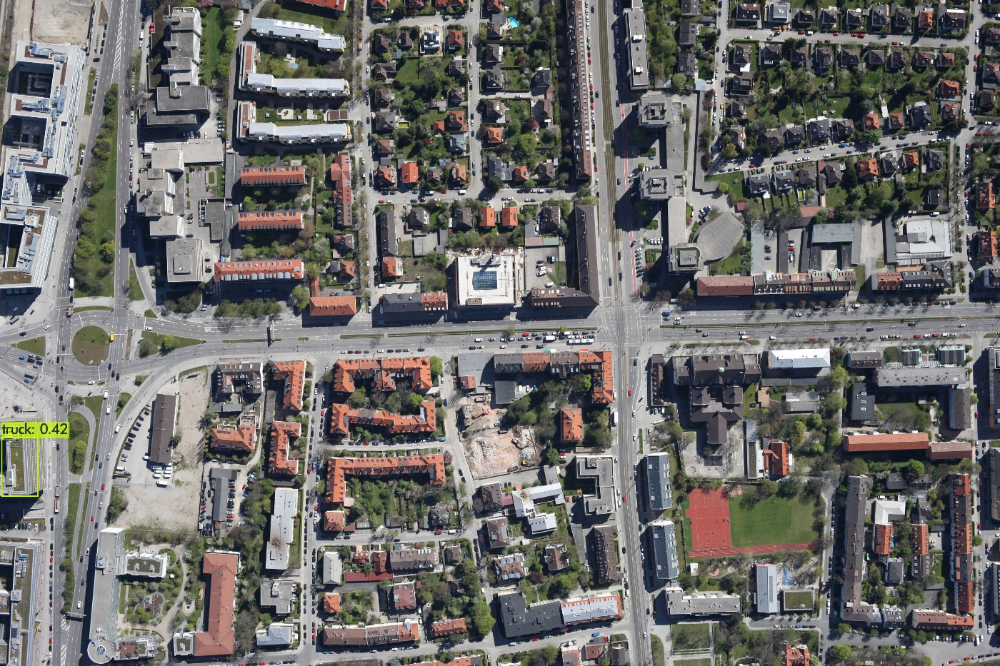
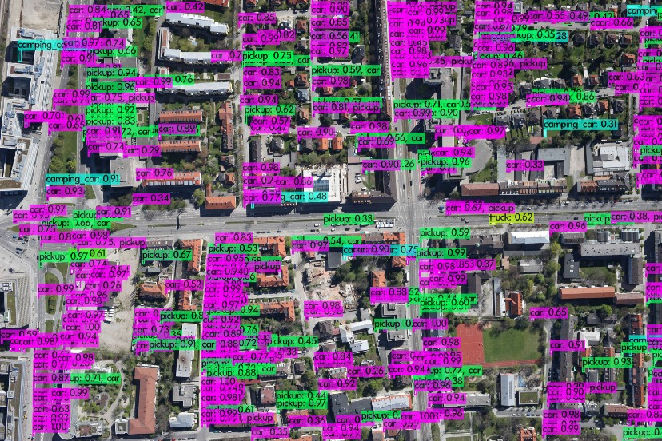

*Research by Undergraduate Assistant Cameron Bass for Dr. Yu Luo on behalf of the Department of Electrical and Computer Engineering at Bagley College of Engineering, Mississippi State University*
<br></br>

# Image Tiling for Image Classification

 This repo contains a simple python script for utilization in various AIML image classification models. It takes and splits an image into crops with a specified size and padding.

  **Note:** *This repo is intended for use in high resolution image classification. Datasets of smaller resolution may result in diminishing or negative returns at the expense of performance.*

<p float="left">
  
   
</p>

 *Images from Bingi Nagesh (https://binginagesh.medium.com/small-object-detection-an-image-tiling-based-approach-bce572d890ca#f637)*
 <br></br>

 Contents
-----------------

[Overview](#overview)
 * [Process](#process)
 * [Requirements](#requirements)
 
[Usage](#usage)
 * [Setup](#setup)
 * [Practice](#practice)
 * [Methods](#methods)
 * [C Usage](#c-usage)

[Example](#example)

[Performance Analysis](#testing)
 * [Complexity](#complexity)
 * [Procedure](#test_procedure)
 * [Test Results](#test_results)
 * [Test Conclusions](#test_conclusions)

[Additional Resources](#resources)

[References](#references)
<br></br>


<a name="Overview"></a>
 ## Overview

 <a name="process"></a>
 ### Process
  The process of high resolution image classification begins by performing a high resolution crop over the base image. These crops are then scaled to the network dimensions within the model and sent for classification. After processing, crops with active bounding boxes are collected and split into smaller resolutions. These new crops are again passed into the algorithm for a final, more precise image classification. 

  While this process inevitably takes a toll on time performance, it greatly increases accuracy on higher resolution images. The performance can be improved by utilizing higher resolution sizes during crops or ignoring step 1, the first low resolution pass. Certain configurations on smaller images may result in diminishing to negative returns. Specific use-case should be given great consideration when deciding on the implementation and crop size.
  
   
   
   *Process as demonstrated by the Previtus Attention Pipeline.*

 <a name="requirements"></a>
 ### Requirements
  This script is lightweight and requires few libraries to function. The required libraries are listed below: 

  * Numpy (<a href="https://www.numpy.org">link</a>)
  * OpenCV (<a href="https://www.opencv.org">link</a>)
<br></br>

 <a name="usage"></a>
 ## Usage

<a name="setup"></a>
 ### Setup
 As previously mentioned, this script requires **numpy**, and **OpenCV** libraries. Below are the installation commands to setup each library respectively. If you are having troubles, check your python and system path for the correct python and pip version.

 Install Numpy
 ```
> pip install numpy
 ```

Install OpenCV

 ```
 > pip install opencv-python
 ```
 
 <a name="practice"></a>
 ### Practice
 In practice, usage in Python is straight-forward. For the purpose of demonstration, I'll be using the Tensorrt_Demos repository by @jkjung-avt as a reference to demonstrate a basic tiling approach with Yolov3 Tiny.

 First, import functions.
 
 ```python
from image_tiler import crop, draw_boxes
 ```

 Grab the frame we are about to process
 ```python
img = cam.read()
 ```

**Step 1: Attention Evaluation** 

 Using the image tiler, tile the image into low resolution crops. (This increases performance, but decreases accuracy. Skip to high resolution crop for increased accuracy)
 ```python
imgs = crop(img, 1028)
 ```

 For each new image, run image classification
 ```python
for i in imgs:
    boxes, confs, clss = trt_yolo.detect(i, conf_th)
 ```

**Step 2: Active Crop Selection** 

 For each image containing an active bounding box, tile into high resolution crops.
 ```python
    if len(boxes) > 0:
        j = crop(i, 416)
    for k in j:
        boxes, confs, clss = trt_yolo.detect(k, conf_th)
 ```

**Step 3: Final Evaluation** 

Perform final evaluation on each crop.
 ```python
    for k in j:
        boxes, confs, clss = trt_yolo.detect(k, conf_th)
 ```

 After we have classification, draw detection bounding boxes on image.
 ```python
draw_boxes(img, boxes)
 ```
 
 Finally, we can display the image.
 ```python
img = show_fps(img, fps)
cv2.imshow(WINDOW_NAME, img)
 ```
 
  <a name="methods"></a>
 ### Methods
  #### crop
  Tiles a standard numpy image array into an array of image crops portional to the given size.
   
   Return 
  > Array of images cropped to size.
  
   Arguments
  > **img**: The image provided to crop. <br>
  > **size**: The desired tile of the new image crops.

 ```python
def crop(img, size, padding = 0):

    height = img.shape[0]
    width = img.shape[1]
    y =  -(height // -size)
    x = -(width // -size)
    
    # split image
    imgs = []
    for i in range (y):
        for j in range(x):
            x1 = j * size - padding
            y1 = i * size - padding
            x2 = (j + 1) * size + padding
            y2 = (i + 1) * size + padding

            rect = clamp_extents(width, height, (y1, y2, x1, x2))
            imgs.append(img[rect[0]:rect[1], rect[2]:rect[3]])

    return imgs
 ```
 
 
  #### draw_boxes
  Uses OpenCV to draw bounding boxes of a desired color and thickness onto an image from an array of bounding box rects.
  
  Return 
  > void
  
  Arguments
  > **img**: The provided images to tile. <br>
  > **boxes**: An array of bounding boxes expected in teh following format: **(class, confidence, (x1, y1, x2, y2))**. <br> 
  > **color**: The color of the boxes to draw. Default: (255, 0, 0). **(optional)** <br>
  > **thickness**: The line thickness of the boxes to draw. Default: 5px. **(optional)**

 ```python
def draw_boxes(img, boxes, color = (255, 0, 0), thickness = 5):

    for box in boxes:
        cls = box[0]
        conf = box[1]

        x1 = box[2][0]
        y1 = box[2][1]
        x2 = box[2][2]
        y2 = box[2][3]
        
        cv2.rectangle(img, (x1, y1), (x2, y2), color, thickness)
        cv2.putText(img, cls + ': ' + str(conf), (x1, y1-10), cv2.FONT_HERSHEY_SIMPLEX, 0.9, color, 2)
 ```
 
  
 <a name="c-usage"></a>
 ### Usage with C/C++
 Unfortunately, this repo only supports python, however embedding the code with C wrapper is possible. As this process can be fairly complex and depends on the your model, a wrapper is not included. Links to resources on the process of embedding python, however, are listed below: 

 * [Extending Python](https://docs.python.org/3/extending/embedding.html)
 * [Quickly Embed Python in C Application](https://medium.datadriveninvestor.com/how-to-quickly-embed-python-in-your-c-application-23c19694813)
 * [Embedding Python in C/C++: Part I](https://www.codeproject.com/Articles/11805/Embedding-Python-in-C-C-Part-I)

 If you find this process difficult or time consuming, the principles applied within the python script should be easily portable to other languages.
<br></br>

<a name="Example"></a>
 ## Example

 Below is simple example of one possible implementation using the script.

 ```python
    # import image tiler
    import image_tiler

    # Perform low resolution crop
    imgs = crop(img, 1024)

    # Pass into algorithm ---->
    # Collect bounding boxes <----

    # Perform high resolution crop on images with active boxes
    for i in active:
        imgs = crop(i, 416)

        # Pass into algorithm ---->
        # Collect bounding boxes <----

    # Draw collected bounding boxes on original image
    draw_boxes(img, boxes)

    # Display final image

 ```
<br></br>

<a name="testing"></a>
Performance Analysis
-----------------
 
 <a name="complexity"></a>
 ### Time Complexity
 This script and its usage have been designed with performance in mind. At its worst, running a high resolution crop over an image will result in a **O(n), where 'n' is equivalent to the tiles generated**. Following the process outlined and utilizing a low resolution crop first will help to greatly reduce the calculations needed. However, this may also decrease accuracy. Thought should be given as to the specific use-case before deciding on an implementation.

<a name="test_procedure"></a>
### Test Procedures

Tests were conducted by evaluting the the performance across several annotated datasets. The test results were then compared against a non-tiled approach utilizing the same configuration and datasets. All tests were carried out on a Jetson Nano using the TensorRT Yolov3 Tiny model provided by @jkjung-avt and weights by @pjreddie. The images were classified via the standard COCO name set. A confidence threshold of 0.1 was used. A breakdown of the datasets is listed below:

* COCO 2017 Val (<a href="https://cocodataset.org/#home">link</a>): 5k images, annotations
* TJU-DHD Traffic (<a href="https://github.com/tjubiit/TJU-DHD">link</a>): 5k images, annotations
* TJU-DHD Campus (<a href="https://github.com/tjubiit/TJU-DHD">link</a>): varied, annotations
* DLR-MVDA (<a href="https://www.dlr.de/eoc/en/desktopdefault.aspx/tabid-12760/22294_read-52777">link</a>) - 10 high resolution images

A sample of the output images can be found in the <a href="Output/">Output</a> folder.

**Device Specifications**:

| Jetson Nano   |                      |
|----------|-------------------|
| Processor|  Quad-core ARM Cortex-A57 MPCore processor |
| Graphics |    NVIDIA Maxwell architecture with 128 NVIDIA CUDA cores  |
| Memory | 4 GB 64-bit LPDDR4  |
| Storage | 16 GB eMMC 5.1   |

<a name="test_results"></a>
### Test Results

The test results are broken down in the following section. Looking at a side by side of the images, there is a clear improvement in the amount of detections after tiling. Unfortunately this is still no where near the amount of detections expected. See [Test Conclusions](#test-conclusions) for further information.

| Before   |      After      |  Expected |        
|----------|-----------------|-----------|
||||

#### FPS

| Standard FPS   |      FPS w/ Tiling    |        
|----------------|-----------------------|
|||

#### mAP

| Standard mAP   |      mAP w/ Tiling    |        
|----------------|-----------------------|
|||

#### Object Distribution

| Standard Distribution   |      Distribution w/ Tiling    |        
|-------------------------|----------------------------|
|||

<a name="test_conclusions"></a>
### Test Conclusions

Despite improvements in detection accuracy, testing did not quite reflect the desired results. I don't believe that this is a fault of implementation, but rather due to 2 main factors:

1. The high resolution data sets used all consist of arial images. I believe that the model used (YOLOv3 Tiny) has not been sufficiently trained on similar sets. Thus, we get more detections as a result of the high resolution crops. However, the lack of training means that these detections may not be as accurate as desired.
2. Standard datasets are typically targeted at low to mid resolution images. Depending on the tiling size set when cropping, there is the potential to obscure objects with high resolution crops that are too small. I've illustrated an example below:


Overall, the tiling process seams to be quite particular to that specific use-case when implementing. Consideration should be given to both performance and expected object size. Crops too small may work great on high resolution images, but obscure data on smaller images.

<a name="resources"></a>
Additional Resources
-------------------

### Small Object Detection: An Image Tiling Based Approach
#### Author: Bingi Nagesh
A great article by Data Scientist Bingi Nagesh that discuss the benefits and procedure of tiling based image processing. It contains accessments of and a breadown of Computer Vision's approach to the issue. Included also are resources to high resolution datasets and various snippets of code used during his testing.

(<a href="https://binginagesh.medium.com/small-object-detection-an-image-tiling-based-approach-bce572d890ca#f637">link</a>)

### Attention Pipeline by Previtus
The Previtus Attention Pipeline is a model that utilizes the image tiling method in conjunction with YOLOv2 and Tensor Flow to produce fast and accurate object detection on high resolutoin images. They have an in depth breakdown of the process and have been written about in numerous publications. The procedure outlined here is directly inspired by the Attention Pipeline.

(<a href="https://github.com/previtus/AttentionPipeline">link</a>)

### Object Detection in 4K Dashcam Videos
#### Author: Karel Majek
Sofware Engineer Karel Majek outlines in this article the data sets and configuration used to accurately classify 4k dashcam footage. He includes resources to the 4k footage and a demonstration of the end result. Here he breifly mentions the API used and compares the performance of various AIML models

(<a href="https://medium.com/@karol_majek/object-detection-in-4k-dashcam-videos-237c30ade356">link</a>)

### Tile (slice) YOLO Dataset for Small Objects Detection
#### Author: slanj
Github user @slanj has created a similar repository for tiling image sets for training. While the target of this repository is live image tiling from a video camera, @slanj takes a different approach by tiling already existing image directories. This use-case may not work for live footage, but could be easily repurposable. It is a great resources for anyone curious about other possible implementations

(<a href="https://github.com/slanj/yolo-tiling">link</a>)
<br></br>

<a name="references"></a>
References
-------------------

[1] https://binginagesh.medium.com/small-object-detection-an-image-tiling-based-approach-bce572d890ca#f637

[2] https://computer-vision-talks.com/tile-based-image-processing/

[3] https://medium.com/@karol_majek/object-detection-in-4k-dashcam-videos-237c30ade356

[4] https://github.com/previtus/AttentionPipeline

[5] https://github.com/slanj/yolo-tiling

[6] https://ieeexplore.ieee.org/document/7560644

[7] https://pjreddie.com/darknet/

[8] https://github.com/jkjung-avt/tensorrt_demos

[9] https://cocodataset.org/#home

[10] https://github.com/tjubiit/TJU-DHD

[11] https://www.dlr.de/eoc/en/desktopdefault.aspx/tabid-12760/22294_read-52777