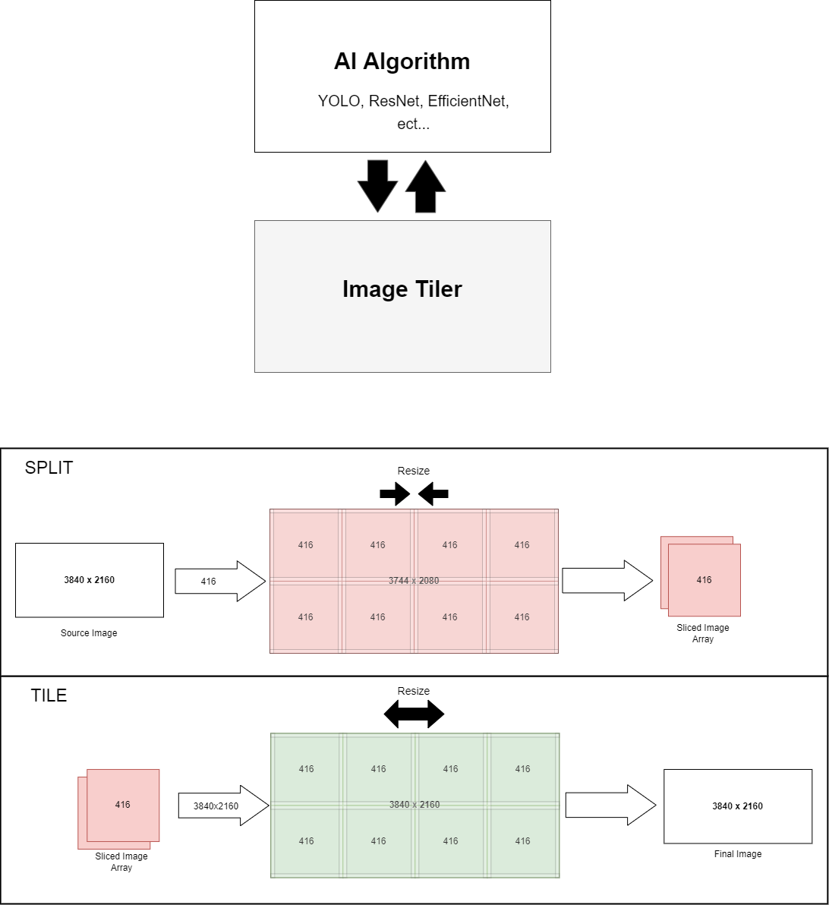

# OpenCV Image Tiler
### OpenCV Image Tiling Utilites
 A simple OpenCV ultility used to split and tile images. For utilization in AIML image tiling and classification models.  
 
 
 ---
 
 Contents
-----------------

[Setup](#setup)
 * [Python Setup](#py-setup)
 * [C Setup](#c-setup)
 
[Usage](#usage)
 * [Python Usage](#py-usage)
 * [Python Methods](#py-methods)
 * [C Usage](#c-usage)
 * [C Methods](#c-methods)

[Testing](#testing)


<a name="setup"></a>
Setup
------------

 <a name="py-setup"></a>
 ### Python Setup
 To setup we simply need drop the 'image_tiler.py' file in a designated folder and import it from the following:
 ```python
from image_tiler import split, tile
 ```
 
 <a name="c-usage"></a>
 ### C Setup
 Unfortunately, using our C wrapper is a bit more complex than the strictly Python implementation.

 Since this is embedded python code. we first need to link your 'pyconfig.h' in the make file.
 ```c

 ```

 Alternatively, you can compile by running something like the following:
 ```c

 ```

 <a name="usage"></a>
 Usage
 ------------
  <a name="py-usage"></a>
 ### Python Usage
 Usage in Python is straight-forward. For the purpose of demonstration, I'll be using the Tensorrt_Demos by @jkjung-avt to demonstrate a basic tiling algorithm approach with Yolov3 Tiny.

 First, grab the frame we are about to process
 ```python
img = cam.read()
 ```

 Using the image tiler, split the image into desired size
 ```python
imges = split(img)
 ```

 For each new image, run image classification and draw detections
 ```python
for i in imges:
    boxes, confs, clss = trt_yolo.detect(i, conf_th)
    i = vis.draw_bboxes(i, boxes, confs, clss)
 ```

 After we have classification, recompile image for display
 ```python
img = tile(imges, width, height)
 ```
 
 Finally we can display the image
 ```python
img = show_fps(img, fps)
cv2.imshow(WINDOW_NAME, img)
 ```
 
  <a name="py-methods"></a>
 ### Python Methods
  #### split
  Splits standard numpy image data into an image array portional to slice size. Will resize provided image if slice size does not fit evenly.
   
   Return 
  > numpy::ndarray[]
  
   Arguments
  > **img** (ndarray) The image provided to split.
  > **slice_size** (int) The desired slice size of the new images.

 ```python
 def split(image, slice_size = 416):

    # scale image to match slice dimension
    height = image.shape[0]
    width = image.shape[1]
    y_scale = math.ceil(height / slice_size)
    x_scale = math.ceil(width / slice_size)
    dim = (x_scale * slice_size, y_scale * slice_size)
    
    # apply scale
    image = cv2.resize(image, dim, interpolation=cv2.INTER_CUBIC)
    height = image.shape[0]
    width = image.shape[1]
    
    # split image
    images = []
    for i in range (height // slice_size):
        for j in range((width // slice_size)):
            left = j * slice_size;
            top = i * slice_size;
            right = (j + 1) * slice_size;
            bottom = (i + 1) * slice_size;

            new_image = image[top:bottom, left:right]
            images.append(new_image)

    return images
 ```
 
 
  #### tile
  Tiles a numpy image array into a single image of desired dimensions. If output image does not match the desired dimensions, the image is resized to match.
  
  Return 
  > numpy::ndarray
  
  Arguments
  > **imgs** (ndarray[]) The provided images to tile.
  > **width** (int) The width of the tiled image.
  > **height** (int) The height of the tiled image.

 ```python
def tile(images, width, height):
    
    # scale to tile size
    slice_size = images[0].shape[0]
    y_scale = math.ceil(height / slice_size)
    x_scale = math.ceil(width / slice_size)
    dim = (x_scale * slice_size, y_scale * slice_size)
    
    final_image = np.zeros((height, width, 3), dtype=np.uint8)
    final_image = cv2.resize(final_image, dim, interpolation=cv2.INTER_CUBIC)

    # tile image
    x, y = 0, 0
    for image in images:
        if x + image.shape[1] > final_image.shape[1]:
           x = 0
           y += image.shape[0]
        
        ## image = np.hstack((image, np.zeros((image.shape[0], image.shape[1], 3))))
        final_image[y:image.shape[0] + y, x:image.shape[1] + x, :] = image
        x += image.shape[1]

    # scale final image to target dimensions
    y_scale = height / final_image.shape[0]
    x_scale = width / final_image.shape[1]
    dim = (int(x_scale * final_image.shape[1]), int(y_scale * final_image.shape[0]))
    final_image = cv2.resize(final_image, dim, interpolation=cv2.INTER_CUBIC)

    return final_image
 ```
 
  <a name="c-usage"></a>
 ### C Usage
 For usage in C, again we will utilize the [darknet](https://github.com/AlexeyAB/darknet) fork by @AlexeyAB as an example.
 
 <a name="c-methods"></a>
 ### C Methods
  #### InitTiler
  Initializes the C wrapper to link our python script. Must be called prior to implemenation.
  
  ```c
  
  ```
  
  #### CloseTiler
  Cleans up python script execution. Call after implemenation.
  
  ```c
  
  ```

  #### Split
  Splits a mat_cv image data into an mat_cv image array portional to slice size. Will resize provided image if slice size does not fit evenly.
  
  Return 
  > mat_cv** images
  
  Arguments
  > **img** (mat_cv*) The image provided to split.
  > **slice_size** (int) The desired slice size of the new images.

 ```c
 
 ```


  #### Tile
  Tiles a mat_cv image array into a single mat_cv image of desired dimensions. If output image does not match the desired dimensions, the image is resized to match.
  
  Return 
  > mat_cv* image
  
  Arguments
  > **imgs** (mat_cv**) The provided images to tile.
  > **width** (int) The width of the tiled image.
  > **height** (int) The height of the tiled image.

 ```c

 ```

<a name="testing"></a>
Testing
-----------------
 
 
